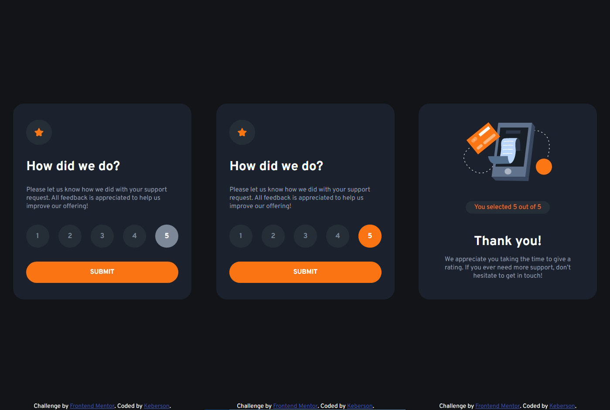
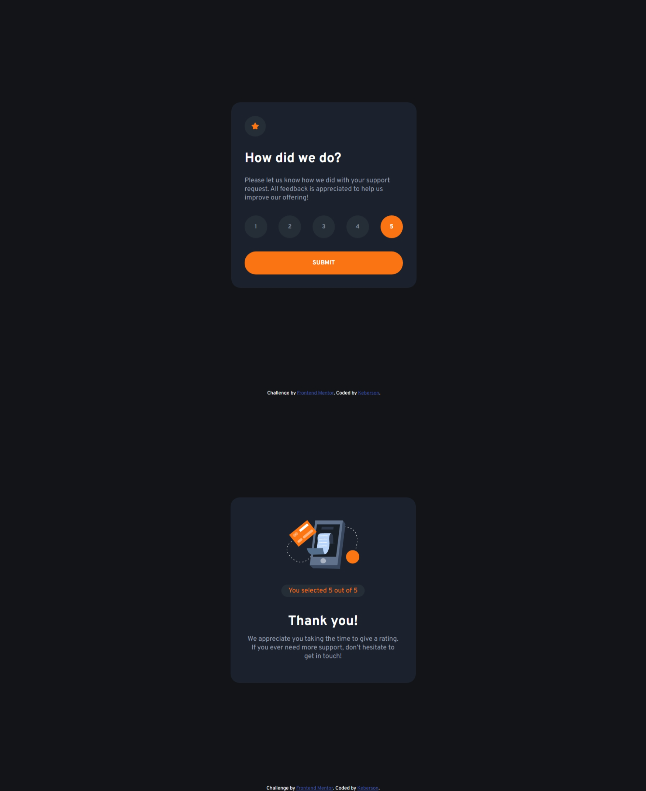

# Frontend Mentor - Interactive rating component solution

This is a solution to the [Interactive rating component challenge on Frontend Mentor](https://www.frontendmentor.io/challenges/interactive-rating-component-koxpeBUmI). Frontend Mentor challenges help you improve your coding skills by building realistic projects. 

## Table of contents

- [Overview](#overview)
  - [The challenge](#the-challenge)
  - [Screenshot](#screenshot)
  - [Links](#links)
- [My process](#my-process)
  - [Built with](#built-with)
  - [Run](#run)
- [Author](#author)


## Overview

### The challenge

Users should be able to:

- View the optimal layout for the app depending on their device's screen size
- See hover states for all interactive elements on the page
- Select and submit a number rating
- See the "Thank you" card state after submitting a rating

### Screenshot

Mobile (375px) version:



Desktop (1440px) version:



### Links

- Solution URL: [GitHub](https://github.com/Keberson/interactive-rating-component-main)
- Live Site URL: [Netlify](https://interactive-rating-component-main-keberson.netlify.app/)

## My process

### Built with

- Semantic HTML5 markup
- CSS custom properties
- Flexbox
- Mobile-first workflow
- Media queries
- [React](https://reactjs.org/) - JS library

## Run

To run this app use:

```npm start```

## Author

- Frontend Mentor - [@Keberson](https://www.frontendmentor.io/profile/Keberson)
- Telegram - [@Keberson](https://www.t.me/Keberson)
